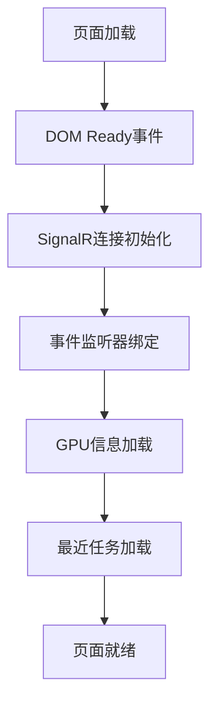
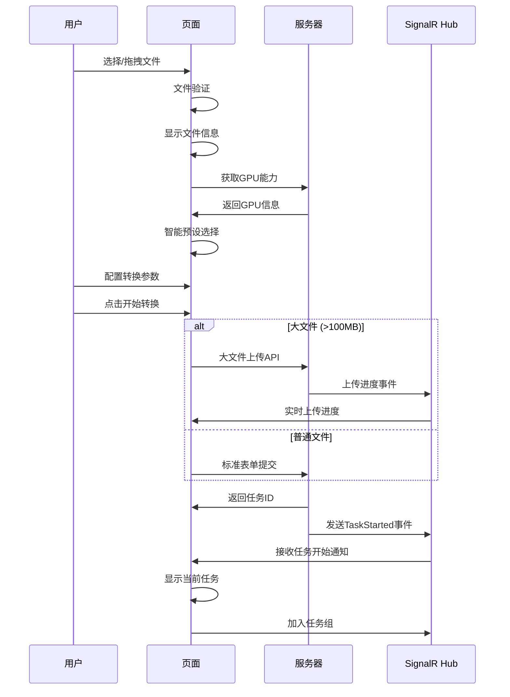
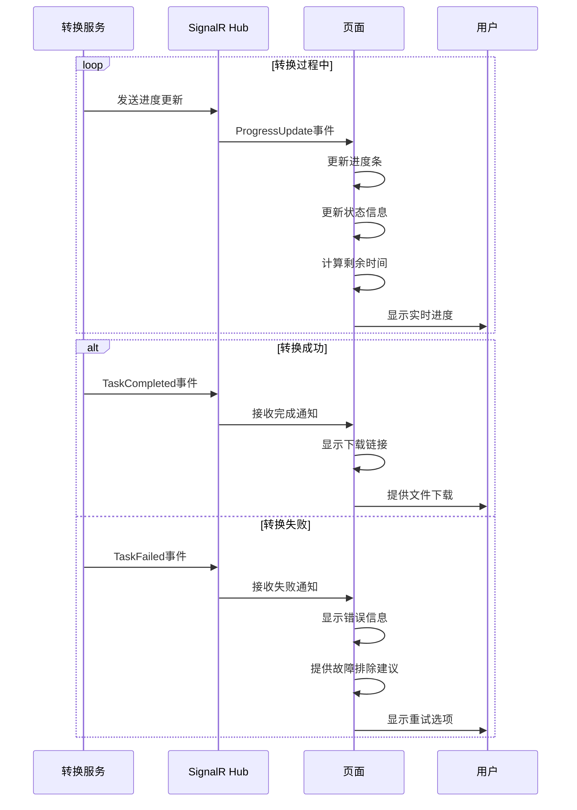
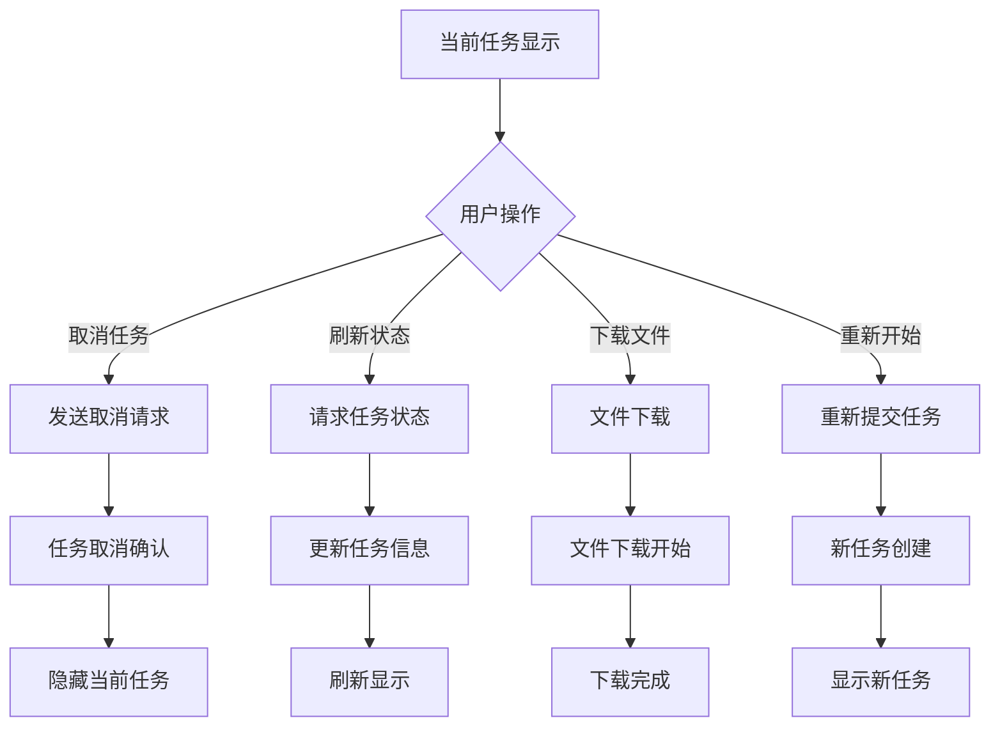

# Index Copy 页面功能与代码逻辑详细分析

## 📋 目录

- [页面整体架构](#页面整体架构)
- [功能模块详细分析](#功能模块详细分析)
- [代码逻辑执行过程](#代码逻辑执行过程)
- [用户操作流程](#用户操作流程)
- [技术实现细节](#技术实现细节)
- [性能优化策略](#性能优化策略)

## 🏗️ 页面整体架构

### 架构概览


### 主要组件
- **文件上传模块** - 支持拖拽和大文件上传
- **转换设置模块** - 智能预设选择和自定义配置
- **SignalR通信模块** - 实时进度更新和状态同步
- **任务管理模块** - 当前任务显示和历史记录
- **GPU硬件加速模块** - 硬件检测和优化建议

## 📊 功能模块详细分析

### 1. 文件上传模块

#### 🎯 功能概述
- **拖拽上传支持** - 用户可以直接拖拽文件到指定区域
- **文件格式验证** - 自动检查支持的视频格式
- **大文件处理** - 超过100MB的文件使用专门的上传API
- **实时进度显示** - 上传过程中显示详细的进度信息

#### 📝 HTML结构
```html
<!-- 文件拖拽区域 -->
<div class="file-drop-zone" id="fileDropZone">
    <div class="text-center">
        <i class="fas fa-cloud-upload-alt fa-3x text-muted mb-3"></i>
        <p class="mb-2">拖拽文件到此处或点击选择</p>
        <input type="file" class="form-control" id="videoFile" name="videoFile" 
               accept="视频格式" required>
    </div>
</div>

<!-- 文件信息显示 -->
<div id="selectedFileInfo" style="display: none;">
    <div class="alert alert-info">
        <i class="fas fa-file-video"></i>
        已选择: <span id="selectedFileName"></span>
        (<span id="selectedFileSize"></span>)
    </div>
</div>

<!-- 上传进度容器 -->
<div id="uploadProgressContainer" style="display: none;">
    <div class="card border-primary">
        <div class="card-header bg-light">
            <h6 class="mb-0">
                <i class="fas fa-upload text-primary"></i>
                文件上传进度
            </h6>
        </div>
        <div class="card-body">
            <div class="progress mb-2" style="height: 20px;">
                <div id="uploadProgressBar" class="progress-bar progress-bar-striped progress-bar-animated bg-primary"
                     role="progressbar" style="width: 0%"></div>
            </div>
            <div class="row text-muted small">
                <div class="col-6">
                    <i class="fas fa-tachometer-alt"></i>
                    速度: <span id="uploadSpeed">0 MB/s</span>
                </div>
                <div class="col-6 text-end">
                    <i class="fas fa-clock"></i>
                    剩余: <span id="uploadTimeRemaining">计算中...</span>
                </div>
            </div>
        </div>
    </div>
</div>
```

#### ⚙️ 代码逻辑执行过程

##### 1. 文件选择处理
```javascript
// 文件选择事件绑定
fileInput.addEventListener('change', function(e) {
    const file = e.target.files[0];
    if (file) {
        handleFileSelection(file);
    }
});

// 文件处理流程
function handleFileSelection(file) {
    // 1. 文件验证
    if (!validateFile(file)) return;
    
    // 2. 显示文件信息
    displayFileInfo(file);
    
    // 3. 触发智能预设选择
    initializeSmartPresetSelection();
}

// 文件验证逻辑
function validateFile(file) {
    const allowedExtensions = ['.mp4', '.avi', '.mov', '.mkv', '.wmv', '.flv', '.webm'];
    const fileName = file.name.toLowerCase();
    const isValidType = allowedExtensions.some(ext => fileName.endsWith(ext));
    
    if (!isValidType) {
        showAlert('danger', '不支持的文件格式');
        return false;
    }
    
    // 检查文件大小限制
    const maxSize = 2 * 1024 * 1024 * 1024; // 2GB
    if (file.size > maxSize) {
        showAlert('danger', '文件大小超过限制');
        return false;
    }
    
    return true;
}
```

##### 2. 拖拽功能实现
```javascript
// 拖拽事件处理
function initializeFileDragDrop() {
    const dropZone = document.getElementById('fileDropZone');
    
    // 防止默认拖拽行为
    ['dragenter', 'dragover', 'dragleave', 'drop'].forEach(eventName => {
        dropZone.addEventListener(eventName, preventDefaults, false);
        document.body.addEventListener(eventName, preventDefaults, false);
    });
    
    // 拖拽进入/离开视觉反馈
    ['dragenter', 'dragover'].forEach(eventName => {
        dropZone.addEventListener(eventName, highlight, false);
    });
    
    ['dragleave', 'drop'].forEach(eventName => {
        dropZone.addEventListener(eventName, unhighlight, false);
    });
    
    // 文件拖拽处理
    dropZone.addEventListener('drop', handleDrop, false);
}

function preventDefaults(e) {
    e.preventDefault();
    e.stopPropagation();
}

function highlight(e) {
    e.currentTarget.classList.add('dragover');
}

function unhighlight(e) {
    e.currentTarget.classList.remove('dragover');
}

function handleDrop(e) {
    const dt = e.dataTransfer;
    const files = dt.files;
    
    if (files.length > 0) {
        const fileInput = document.getElementById('videoFile');
        fileInput.files = files;
        handleFileSelection(files[0]);
    }
}
```

##### 3. 大文件上传处理
```javascript
async function handleLargeFileUpload(file, form) {
    const isLargeFile = file.size > 100 * 1024 * 1024; // 100MB阈值
    
    if (isLargeFile) {
        // 显示上传进度容器
        const uploadContainer = document.getElementById('uploadProgressContainer');
        uploadContainer.style.display = 'block';
        
        // 更新提交按钮状态
        const startButton = document.getElementById('startConversion');
        startButton.disabled = true;
        startButton.innerHTML = '<i class="fas fa-spinner fa-spin"></i> 上传中...';
        
        try {
            // 创建FormData包含所有表单数据
            const formData = new FormData(form);
            
            // 发送到大文件上传API
            const response = await fetch('/api/upload/large-file', {
                method: 'POST',
                body: formData
            });
            
            const result = await response.json();
            
            if (result.success) {
                // 上传成功，处理转换任务创建
                await handleConversionSuccess(result);
                hideUploadProgress();
            } else {
                throw new Error(result.message || '上传失败');
            }
        } catch (error) {
            console.error('大文件上传失败:', error);
            showAlert('danger', '上传失败: ' + error.message);
            hideUploadProgress();
        } finally {
            // 恢复按钮状态
            startButton.disabled = false;
            startButton.innerHTML = '<i class="fas fa-play"></i> 开始转换';
        }
    }
}

// 上传进度更新
function updateUploadProgress(data) {
    const progressBar = document.getElementById('uploadProgressBar');
    const percentage = document.getElementById('uploadPercentage');
    const speed = document.getElementById('uploadSpeed');
    const timeRemaining = document.getElementById('uploadTimeRemaining');
    const uploadedSize = document.getElementById('uploadedSize');
    const fileName = document.getElementById('uploadFileName');
    
    if (progressBar) {
        progressBar.style.width = `${data.Progress}%`;
        progressBar.setAttribute('aria-valuenow', data.Progress);
    }
    
    if (percentage) {
        percentage.textContent = `${data.Progress}%`;
    }
    
    if (speed && data.Speed) {
        speed.textContent = formatFileSize(data.Speed) + '/s';
    }
    
    if (timeRemaining && data.EstimatedTimeRemaining) {
        timeRemaining.textContent = formatTime(data.EstimatedTimeRemaining);
    }
    
    if (uploadedSize) {
        uploadedSize.textContent = formatFileSize(data.UploadedSize);
    }
    
    if (fileName && data.FileName) {
        fileName.textContent = data.FileName;
    }
}
```

### 2. 转换设置模块

#### 🎯 功能概述
- **预设选择** - 提供多种预配置的转换预设
- **智能GPU预设选择** - 根据硬件自动选择最佳预设
- **详细参数配置** - 支持视频、音频、高级选项的精细调整
- **实时参数验证** - 输入参数的即时验证和提示

#### 📝 设置面板结构
```html
<!-- 转换预设选择 -->
<div class="mb-3">
    <label for="preset" class="form-label">转换预设</label>
    <select class="form-select" id="preset" name="preset">
        <!-- 动态生成预设选项 -->
    </select>
</div>

<!-- 详细设置手风琴 -->
<div class="accordion mb-3" id="advancedSettings">
    <!-- 基本设置 -->
    <div class="accordion-item">
        <h2 class="accordion-header">
            <button class="accordion-button" type="button"
                    data-bs-toggle="collapse" data-bs-target="#basicPanel">
                <i class="fas fa-cogs"></i>&nbsp;基本设置
            </button>
        </h2>
        <div id="basicPanel" class="accordion-collapse collapse show">
            <div class="accordion-body">
                <div class="row">
                    <div class="col-md-6">
                        <label for="outputFormat" class="form-label">输出格式</label>
                        <select class="form-select" id="outputFormat" name="outputFormat">
                            <option value="mp4">MP4 (H.264)</option>
                            <option value="mp4_h265">MP4 (H.265/HEVC)</option>
                            <option value="webm">WebM (VP9)</option>
                            <!-- 更多格式选项 -->
                        </select>
                    </div>
                    <div class="col-md-6">
                        <label for="resolution" class="form-label">分辨率</label>
                        <select class="form-select" id="resolution" name="resolution">
                            <option value="">保持原始</option>
                            <option value="3840x2160">4K (3840x2160)</option>
                            <option value="1920x1080">1080p (1920x1080)</option>
                            <!-- 更多分辨率选项 -->
                        </select>
                    </div>
                </div>
            </div>
        </div>
    </div>
    
    <!-- 视频设置 -->
    <div class="accordion-item">
        <h2 class="accordion-header">
            <button class="accordion-button collapsed" type="button"
                    data-bs-toggle="collapse" data-bs-target="#videoPanel">
                <i class="fas fa-video"></i>&nbsp;视频设置
            </button>
        </h2>
        <div id="videoPanel" class="accordion-collapse collapse">
            <div class="accordion-body">
                <!-- 视频编解码器、质量控制等设置 -->
            </div>
        </div>
    </div>
    
    <!-- 音频设置 -->
    <div class="accordion-item">
        <h2 class="accordion-header">
            <button class="accordion-button collapsed" type="button"
                    data-bs-toggle="collapse" data-bs-target="#audioPanel">
                <i class="fas fa-volume-up"></i>&nbsp;音频设置
            </button>
        </h2>
        <div id="audioPanel" class="accordion-collapse collapse">
            <div class="accordion-body">
                <!-- 音频编解码器、比特率等设置 -->
            </div>
        </div>
    </div>
</div>
```

#### ⚙️ 智能预设选择逻辑

##### 1. GPU能力检测和预设选择
```javascript
async function initializeSmartPresetSelection() {
    try {
        console.log('🔍 开始智能GPU预设选择...');

        // 1. 检查GPU能力
        const gpuResponse = await fetch('/api/gpu/capabilities');
        const gpuData = await gpuResponse.json();

        if (gpuData.success && gpuData.data) {
            const capabilities = gpuData.data;
            console.log('GPU能力检测结果:', capabilities);

            // 2. 根据GPU类型选择预设
            if (capabilities.nvidia && capabilities.nvidia.supported) {
                selectBestGpuPreset('nvenc');
                console.log('✅ 自动选择NVIDIA GPU预设');
            } else if (capabilities.intel && capabilities.intel.supported) {
                selectBestGpuPreset('qsv');
                console.log('✅ 自动选择Intel GPU预设');
            } else if (capabilities.amd && capabilities.amd.supported) {
                selectBestGpuPreset('amf');
                console.log('✅ 自动选择AMD GPU预设');
            } else {
                console.log('ℹ️ 未检测到GPU支持，使用默认CPU预设');
            }
        } else {
            console.log('⚠️ GPU检测失败，使用默认预设');
        }
    } catch (error) {
        console.error('❌ 智能预设选择失败:', error);
    }
}

// 选择最佳GPU预设
function selectBestGpuPreset(gpuType) {
    const presetSelect = document.getElementById('preset');
    const options = presetSelect.options;

    // 预设优先级映射
    const presetPriority = {
        'nvenc': [
            'GPU Fast 1080p (NVENC)',
            'GPU High Quality 1080p (NVENC)',
            'GPU 4K Ultra (NVENC)'
        ],
        'qsv': [
            'GPU Fast 1080p (QSV)',
            'GPU High Quality 1080p (QSV)'
        ],
        'amf': [
            'GPU Fast 1080p (AMF)',
            'GPU High Quality 1080p (AMF)'
        ]
    };

    const preferredPresets = presetPriority[gpuType] || [];

    // 按优先级查找并选择预设
    for (const presetName of preferredPresets) {
        for (let i = 0; i < options.length; i++) {
            if (options[i].value === presetName) {
                presetSelect.selectedIndex = i;
                updateAdvancedSettings(presetName);
                updateGpuAccelBadge(getVideoCodecFromPreset(presetName));

                // 显示GPU加速提示
                showGpuAccelNotification(presetName);
                return;
            }
        }
    }
}
```

### 3. SignalR实时通信模块

#### 🎯 功能概述
- **实时双向通信** - 服务器主动推送进度更新
- **自动重连机制** - 网络中断时自动恢复连接
- **任务组管理** - 支持多用户并发任务隔离
- **连接状态监控** - 实时显示连接状态

#### ⚙️ SignalR连接管理

##### 1. 连接初始化和配置
```javascript
// SignalR连接配置
const connection = new signalR.HubConnectionBuilder()
    .withUrl("/conversionHub")
    .withAutomaticReconnect([0, 2000, 10000, 30000]) // 重连间隔：立即、2秒、10秒、30秒
    .configureLogging(signalR.LogLevel.Information)
    .build();

// 全局变量
let currentTaskId = null;
let connectionState = 'Disconnected';
let refreshInterval = null;
let lastRefreshTime = 0;

// 启动连接
async function startConnection() {
    try {
        await connection.start();
        console.log("✅ SignalR连接成功");
        updateConnectionStatus('Connected');
        showAlert('success', 'SignalR连接已建立，可以实时接收转换进度');

        // 连接成功后加载最近任务
        loadRecentTasks();
    } catch (err) {
        console.error("❌ SignalR连接失败:", err);
        updateConnectionStatus('Failed');
        showAlert('danger', 'SignalR连接失败，进度更新可能不可用');

        // 5秒后重试连接
        setTimeout(startConnection, 5000);
    }
}

// 更新连接状态显示
function updateConnectionStatus(status) {
    connectionState = status;
    const statusElement = document.getElementById('connectionStatus');
    if (statusElement) {
        statusElement.textContent = status;
        statusElement.className = `badge ${status === 'Connected' ? 'bg-success' :
                                           status === 'Reconnecting' ? 'bg-warning' : 'bg-danger'}`;
    }
}
```

##### 2. 事件监听器注册
```javascript
// 监听进度更新
connection.on("ProgressUpdate", function (data) {
    console.log("📊 收到进度更新:", data);
    updateProgress(data);
});

// 监听任务开始
connection.on("TaskStarted", function (data) {
    console.log("🚀 任务开始:", data);
    handleTaskStarted(data);
});

// 监听任务完成
connection.on("TaskCompleted", function (data) {
    handleTaskCompleted(data);
});

// 监听任务失败
connection.on("TaskFailed", function (data) {
    handleTaskFailed(data);
});

// 监听上传进度
connection.on("UploadProgress", function (data) {
    updateUploadProgress(data);
});
```

### 4. 任务管理模块

#### 🎯 功能概述
- **当前任务显示** - 实时显示正在进行的转换任务
- **进度实时更新** - 详细的进度条和状态信息
- **任务操作控制** - 取消、刷新、下载、重启等操作
- **历史任务管理** - 最近任务列表和状态跟踪

#### ⚙️ 任务状态管理逻辑

##### 1. 任务开始处理
```javascript
function handleTaskStarted(data) {
    currentTaskId = data.taskId;
    currentTaskStartTime = new Date();

    console.log('🚀 任务开始:', data);

    // 显示当前任务
    showCurrentTask(data);

    // 加入任务组以接收进度更新
    connection.invoke("JoinTaskGroup", data.taskId).catch(err => {
        console.error("加入任务组失败:", err);
    });

    // 开始计时
    startTaskTimer();

    // 更新UI状态
    updateTaskUI('running');

    // 显示通知
    showAlert('info', `转换任务已开始: ${data.fileName || data.taskId}`);
}

// 显示当前任务
function showCurrentTask(data) {
    const currentTaskDiv = document.getElementById('currentTask');
    if (!currentTaskDiv) return;

    // 更新任务信息
    document.getElementById('currentTaskName').textContent = data.fileName || data.taskId;
    document.getElementById('taskId').textContent = data.taskId;

    // 显示文件信息
    if (data.fileName) {
        document.getElementById('originalFileName').textContent = data.fileName;
        document.getElementById('fileInfo').style.display = 'block';
    }

    // 重置进度条
    const progressBar = document.getElementById('progressBar');
    progressBar.style.width = '0%';
    progressBar.setAttribute('aria-valuenow', '0');
    progressBar.querySelector('span').textContent = '0%';

    // 显示任务容器
    currentTaskDiv.style.display = 'block';

    // 绑定操作按钮事件
    bindTaskActionButtons(data.taskId);
}

// 绑定任务操作按钮
function bindTaskActionButtons(taskId) {
    // 取消任务按钮
    const cancelBtn = document.getElementById('cancelTask');
    if (cancelBtn) {
        cancelBtn.onclick = () => cancelTask(taskId);
    }

    // 刷新状态按钮
    const refreshBtn = document.getElementById('refreshTask');
    if (refreshBtn) {
        refreshBtn.onclick = () => refreshTaskStatus(taskId);
    }

    // 重新开始按钮
    const restartBtn = document.getElementById('restartTask');
    if (restartBtn) {
        restartBtn.onclick = () => restartTask(taskId);
    }
}
```

##### 2. 进度更新处理
```javascript
function updateProgress(data) {
    if (!data || !data.taskId) return;

    // 只更新当前任务的进度
    if (data.taskId !== currentTaskId) return;

    console.log('📊 更新进度:', data);

    // 更新进度条
    const progressBar = document.getElementById('progressBar');
    const progressText = progressBar.querySelector('span');

    if (progressBar) {
        progressBar.style.width = `${data.progress}%`;
        progressBar.setAttribute('aria-valuenow', data.progress);
        progressText.textContent = `${data.progress}%`;
    }

    // 更新详细信息
    updateTaskDetails(data);

    // 更新最近任务列表中的进度
    updateRecentTaskProgress(data.taskId, data.progress);
}

// 更新任务详细信息
function updateTaskDetails(data) {
    // 更新转换速度
    if (data.speed && document.getElementById('conversionSpeed')) {
        document.getElementById('conversionSpeed').textContent = data.speed;
    }

    // 更新剩余时间
    if (data.remainingSeconds && document.getElementById('remainingTime')) {
        const remainingTime = formatTime(data.remainingSeconds);
        document.getElementById('remainingTime').textContent = remainingTime;
    }

    // 更新已用时间
    if (currentTaskStartTime && document.getElementById('elapsedTime')) {
        const elapsedSeconds = Math.floor((new Date() - currentTaskStartTime) / 1000);
        const elapsedTime = formatTime(elapsedSeconds);
        document.getElementById('elapsedTime').textContent = elapsedTime;
    }

    // 更新状态消息
    if (data.message && document.getElementById('taskStatus')) {
        document.getElementById('taskStatus').textContent = data.message;
    }
}

// 格式化时间显示
function formatTime(seconds) {
    if (!seconds || seconds <= 0) return '-';

    const hours = Math.floor(seconds / 3600);
    const minutes = Math.floor((seconds % 3600) / 60);
    const secs = seconds % 60;

    if (hours > 0) {
        return `${hours}:${minutes.toString().padStart(2, '0')}:${secs.toString().padStart(2, '0')}`;
    } else {
        return `${minutes}:${secs.toString().padStart(2, '0')}`;
    }
}
```

##### 3. 任务完成和失败处理
```javascript
function handleTaskCompleted(data) {
    console.log('✅ 任务完成:', data);

    currentTaskId = null;
    currentTaskStartTime = null;

    // 更新进度条为100%
    const progressBar = document.getElementById('progressBar');
    if (progressBar) {
        progressBar.style.width = '100%';
        progressBar.setAttribute('aria-valuenow', '100');
        progressBar.querySelector('span').textContent = '100%';
        progressBar.classList.remove('progress-bar-animated');
        progressBar.classList.add('bg-success');
    }

    // 更新状态
    const statusElement = document.getElementById('taskStatus');
    if (statusElement) {
        statusElement.textContent = '转换完成！';
        statusElement.parentElement.className = 'alert alert-success';
    }

    // 显示下载按钮
    if (data.downloadUrl) {
        showDownloadButton(data.downloadUrl, data.fileName);
    }

    // 隐藏取消按钮，显示其他操作按钮
    updateTaskActionButtons('completed');

    // 刷新最近任务列表
    loadRecentTasks();

    // 显示成功消息
    const duration = data.duration ? ` (耗时: ${formatTime(data.duration)})` : '';
    showAlert('success', `转换完成: ${data.fileName || data.taskId}${duration}`);
}

function handleTaskFailed(data) {
    console.log('❌ 任务失败:', data);

    currentTaskId = null;
    currentTaskStartTime = null;

    // 更新进度条样式
    const progressBar = document.getElementById('progressBar');
    if (progressBar) {
        progressBar.classList.remove('progress-bar-animated');
        progressBar.classList.add('bg-danger');
    }

    // 更新状态
    const statusElement = document.getElementById('taskStatus');
    if (statusElement) {
        statusElement.textContent = `转换失败: ${data.error || '未知错误'}`;
        statusElement.parentElement.className = 'alert alert-danger';
    }

    // 显示故障排除建议
    showTroubleshootingTips(data.error);

    // 更新操作按钮
    updateTaskActionButtons('failed');

    // 刷新最近任务列表
    loadRecentTasks();

    // 显示错误消息
    showAlert('danger', `转换失败: ${data.fileName || data.taskId} - ${data.error || '未知错误'}`);
}

// 显示下载按钮
function showDownloadButton(downloadUrl, fileName) {
    const downloadBtn = document.getElementById('downloadTask');
    if (downloadBtn) {
        downloadBtn.href = downloadUrl;
        downloadBtn.download = fileName || 'converted_video';
        downloadBtn.style.display = 'inline-block';
    }
}

// 更新任务操作按钮状态
function updateTaskActionButtons(status) {
    const cancelBtn = document.getElementById('cancelTask');
    const refreshBtn = document.getElementById('refreshTask');
    const downloadBtn = document.getElementById('downloadTask');
    const restartBtn = document.getElementById('restartTask');

    switch (status) {
        case 'running':
            if (cancelBtn) cancelBtn.style.display = 'inline-block';
            if (refreshBtn) refreshBtn.style.display = 'inline-block';
            if (downloadBtn) downloadBtn.style.display = 'none';
            if (restartBtn) restartBtn.style.display = 'none';
            break;
        case 'completed':
            if (cancelBtn) cancelBtn.style.display = 'none';
            if (refreshBtn) refreshBtn.style.display = 'none';
            if (downloadBtn) downloadBtn.style.display = 'inline-block';
            if (restartBtn) restartBtn.style.display = 'inline-block';
            break;
        case 'failed':
            if (cancelBtn) cancelBtn.style.display = 'none';
            if (refreshBtn) refreshBtn.style.display = 'inline-block';
            if (downloadBtn) downloadBtn.style.display = 'none';
            if (restartBtn) restartBtn.style.display = 'inline-block';
            break;
    }
}
```

### 5. GPU硬件加速模块

#### 🎯 功能概述
- **GPU能力检测** - 自动检测NVIDIA、Intel、AMD GPU支持
- **硬件加速状态显示** - 实时显示GPU加速可用性
- **智能编码器推荐** - 根据硬件自动推荐最佳编码器
- **性能优化建议** - 提供GPU优化配置建议

#### ⚙️ GPU检测逻辑

##### 1. GPU信息加载
```javascript
async function loadGpuInfo() {
    const gpuInfoDiv = document.getElementById('gpuInfo');
    if (!gpuInfoDiv) return;

    try {
        // 显示加载状态
        gpuInfoDiv.innerHTML = `
            <div class="text-center">
                <div class="spinner-border spinner-border-sm text-primary" role="status">
                    <span class="visually-hidden">检测中...</span>
                </div>
                <p class="mt-2 mb-0 text-muted">正在检测GPU硬件加速能力...</p>
            </div>
        `;

        const response = await fetch('/api/gpu/capabilities');
        const result = await response.json();

        if (result.success) {
            displayGpuInfo(result.data);
        } else {
            displayGpuError('获取GPU信息失败: ' + (result.message || '未知错误'));
        }
    } catch (error) {
        console.error('GPU信息加载失败:', error);
        displayGpuError('无法连接到GPU检测服务');
    }
}

// 显示GPU信息
function displayGpuInfo(gpuData) {
    const gpuInfoDiv = document.getElementById('gpuInfo');
    if (!gpuInfoDiv) return;

    if (!gpuData.hasAnyGpuSupport) {
        // 无GPU支持的情况
        gpuInfoDiv.innerHTML = `
            <div class="text-center text-muted py-4">
                <i class="fas fa-exclamation-triangle fa-2x text-warning mb-3"></i>
                <h6>未检测到GPU硬件加速支持</h6>
                <p class="mb-2">系统将使用CPU进行视频转码</p>
                <small class="text-muted">
                    检测时间: ${new Date().toLocaleString()}
                </small>
                <div class="mt-3">
                    <button class="btn btn-outline-primary btn-sm" onclick="loadGpuInfo()">
                        <i class="fas fa-redo"></i> 重新检测
                    </button>
                </div>
            </div>
        `;
        return;
    }

    // 有GPU支持的情况
    let html = `
        <div class="alert alert-success mb-3">
            <div class="d-flex justify-content-between align-items-center">
                <div>
                    <strong><i class="fas fa-check-circle"></i> GPU硬件加速可用!</strong><br>
                    <small>支持的GPU类型: ${getSupportedGpuTypes(gpuData)}</small>
                </div>
                <button class="btn btn-outline-success btn-sm" onclick="loadGpuInfo()">
                    <i class="fas fa-redo"></i>
                </button>
            </div>
        </div>
    `;

    // NVIDIA NVENC
    if (gpuData.nvidia && gpuData.nvidia.supported) {
        html += generateGpuCard('NVIDIA NVENC', gpuData.nvidia, 'success');
    }

    // Intel QSV
    if (gpuData.intel && gpuData.intel.supported) {
        html += generateGpuCard('Intel QSV', gpuData.intel, 'info');
    }

    // AMD AMF
    if (gpuData.amd && gpuData.amd.supported) {
        html += generateGpuCard('AMD AMF', gpuData.amd, 'warning');
    }

    html += `
        <div class="mt-3">
            <small class="text-muted">
                <i class="fas fa-clock"></i> 检测时间: ${new Date().toLocaleString()}
            </small>
        </div>
    `;

    gpuInfoDiv.innerHTML = html;
}

// 生成GPU卡片
function generateGpuCard(title, gpuInfo, variant) {
    const iconMap = {
        'NVIDIA NVENC': 'fas fa-microchip text-success',
        'Intel QSV': 'fas fa-microchip text-info',
        'AMD AMF': 'fas fa-microchip text-warning'
    };

    return `
        <div class="card mb-2 border-${variant}">
            <div class="card-body p-3">
                <h6 class="card-title">
                    <i class="${iconMap[title] || 'fas fa-microchip'}"></i> ${title}
                </h6>
                <div class="row">
                    <div class="col-6">
                        <small class="text-muted">设备数量</small><br>
                        <span class="fw-bold">${gpuInfo.deviceCount || 0}</span>
                    </div>
                    <div class="col-6">
                        <small class="text-muted">编码器数量</small><br>
                        <span class="fw-bold">${gpuInfo.encoders?.length || 0}</span>
                    </div>
                </div>
                ${gpuInfo.encoders && gpuInfo.encoders.length > 0 ? `
                    <div class="mt-2">
                        <small class="text-muted">支持的编码器:</small><br>
                        <div class="d-flex flex-wrap gap-1 mt-1">
                            ${gpuInfo.encoders.map(encoder =>
                                `<span class="badge bg-${variant}">${encoder}</span>`
                            ).join('')}
                        </div>
                    </div>
                ` : ''}
                ${gpuInfo.maxResolution ? `
                    <div class="mt-2">
                        <small class="text-muted">最大分辨率: </small>
                        <span class="fw-bold">${gpuInfo.maxResolution}</span>
                    </div>
                ` : ''}
            </div>
        </div>
    `;
}

// 获取支持的GPU类型列表
function getSupportedGpuTypes(gpuData) {
    const types = [];
    if (gpuData.nvidia?.supported) types.push('NVIDIA');
    if (gpuData.intel?.supported) types.push('Intel');
    if (gpuData.amd?.supported) types.push('AMD');
    return types.join(', ') || '无';
}

// 显示GPU错误信息
function displayGpuError(errorMessage) {
    const gpuInfoDiv = document.getElementById('gpuInfo');
    if (!gpuInfoDiv) return;

    gpuInfoDiv.innerHTML = `
        <div class="alert alert-warning">
            <h6><i class="fas fa-exclamation-triangle"></i> GPU信息加载失败</h6>
            <p class="mb-2">${errorMessage}</p>
            <button class="btn btn-outline-primary btn-sm" onclick="loadGpuInfo()">
                <i class="fas fa-redo"></i> 重新检测
            </button>
        </div>
    `;
}
```

## 🔄 完整的用户操作流程

### 流程1：文件选择到转换开始



### 流程2：转换进度实时更新



### 流程3：任务操作控制



## 🛠️ 关键技术实现细节

### 1. 文件大小检测和处理策略

#### 文件大小阈值判断
```javascript
// 文件大小检测逻辑
function determineUploadMethod(file) {
    const LARGE_FILE_THRESHOLD = 100 * 1024 * 1024; // 100MB阈值
    const MAX_FILE_SIZE = 2 * 1024 * 1024 * 1024;   // 2GB最大限制

    if (file.size > MAX_FILE_SIZE) {
        throw new Error(`文件大小超过限制: ${formatFileSize(file.size)} > ${formatFileSize(MAX_FILE_SIZE)}`);
    }

    if (file.size > LARGE_FILE_THRESHOLD) {
        return {
            method: 'large-file-api',
            endpoint: '/api/upload/large-file',
            showProgress: true
        };
    } else {
        return {
            method: 'normal-form-submit',
            endpoint: '/api/conversion/start',
            showProgress: false
        };
    }
}

// 文件大小格式化
function formatFileSize(bytes) {
    if (!bytes || bytes === 0) return '0 B';
    const k = 1024;
    const sizes = ['B', 'KB', 'MB', 'GB', 'TB'];
    const i = Math.floor(Math.log(bytes) / Math.log(k));
    return `${(bytes / Math.pow(k, i)).toFixed(i === 0 ? 0 : 1)} ${sizes[i]}`;
}
```

#### 大文件分块上传处理
```javascript
// 大文件分块上传实现
async function uploadLargeFileInChunks(file, chunkSize = 5 * 1024 * 1024) { // 5MB chunks
    const totalChunks = Math.ceil(file.size / chunkSize);
    let uploadedChunks = 0;

    for (let i = 0; i < totalChunks; i++) {
        const start = i * chunkSize;
        const end = Math.min(start + chunkSize, file.size);
        const chunk = file.slice(start, end);

        const formData = new FormData();
        formData.append('chunk', chunk);
        formData.append('chunkIndex', i);
        formData.append('totalChunks', totalChunks);
        formData.append('fileName', file.name);
        formData.append('fileSize', file.size);

        try {
            const response = await fetch('/api/upload/chunk', {
                method: 'POST',
                body: formData
            });

            if (response.ok) {
                uploadedChunks++;
                const progress = Math.round((uploadedChunks / totalChunks) * 100);
                updateUploadProgress({
                    Progress: progress,
                    UploadedSize: uploadedChunks * chunkSize,
                    TotalSize: file.size
                });
            } else {
                throw new Error(`分块上传失败: ${response.statusText}`);
            }
        } catch (error) {
            console.error(`分块 ${i} 上传失败:`, error);
            throw error;
        }
    }
}
```

### 2. 实时进度计算和显示

#### 进度计算算法
```javascript
// 进度更新处理
function updateProgress(data) {
    // 计算转换速度
    const speed = calculateConversionSpeed(data);

    // 估算剩余时间
    const remainingTime = estimateRemainingTime(data.progress, speed);

    // 更新UI显示
    updateProgressDisplay(data.progress, speed, remainingTime);

    // 更新性能统计
    updatePerformanceStats(data);
}

// 转换速度计算
function calculateConversionSpeed(data) {
    if (data.details && data.details.speed) {
        // 从FFmpeg输出解析速度 (例如: "2.5x")
        const speedMatch = data.details.speed.match(/(\d+\.?\d*)x/);
        if (speedMatch) {
            return parseFloat(speedMatch[1]);
        }
    }

    // 基于进度变化计算速度
    if (lastProgressUpdate && lastProgressUpdate.timestamp) {
        const timeDiff = (Date.now() - lastProgressUpdate.timestamp) / 1000; // 秒
        const progressDiff = data.progress - lastProgressUpdate.progress;

        if (timeDiff > 0 && progressDiff > 0) {
            return progressDiff / timeDiff; // 每秒进度百分比
        }
    }

    // 记录当前进度用于下次计算
    lastProgressUpdate = {
        progress: data.progress,
        timestamp: Date.now()
    };

    return 0;
}

// 剩余时间估算
function estimateRemainingTime(progress, speed) {
    if (progress >= 100 || speed <= 0) return 0;

    const remainingProgress = 100 - progress;

    // 基于转换速度估算
    if (speed > 0) {
        return Math.round(remainingProgress / speed);
    }

    // 基于平均速度估算
    if (currentTaskStartTime) {
        const elapsedSeconds = (Date.now() - currentTaskStartTime) / 1000;
        const averageSpeed = progress / elapsedSeconds;

        if (averageSpeed > 0) {
            return Math.round(remainingProgress / averageSpeed);
        }
    }

    return 0;
}

// 性能统计更新
function updatePerformanceStats(data) {
    const stats = {
        currentSpeed: data.details?.speed || '0x',
        averageSpeed: calculateAverageSpeed(),
        peakSpeed: updatePeakSpeed(data.details?.speed),
        efficiency: calculateEfficiency(data)
    };

    // 更新性能显示
    displayPerformanceStats(stats);
}
```

### 3. 错误处理和恢复机制

#### 分层错误处理
```javascript
// 全局错误处理器
function handleError(error, context, options = {}) {
    console.error(`错误发生在 ${context}:`, error);

    // 错误分类处理
    const errorType = classifyError(error);

    switch (errorType) {
        case 'NetworkError':
            handleNetworkError(error, context, options);
            break;
        case 'ValidationError':
            handleValidationError(error, context, options);
            break;
        case 'ServerError':
            handleServerError(error, context, options);
            break;
        case 'TimeoutError':
            handleTimeoutError(error, context, options);
            break;
        default:
            handleGenericError(error, context, options);
    }

    // 记录错误到控制台和可能的日志服务
    logError(error, context);
}

// 错误分类
function classifyError(error) {
    if (error.name === 'TypeError' && error.message.includes('fetch')) {
        return 'NetworkError';
    }
    if (error.name === 'ValidationError' || error.status === 400) {
        return 'ValidationError';
    }
    if (error.status >= 500) {
        return 'ServerError';
    }
    if (error.name === 'TimeoutError' || error.code === 'TIMEOUT') {
        return 'TimeoutError';
    }
    return 'GenericError';
}

// 网络错误处理
function handleNetworkError(error, context, options) {
    showAlert('warning', '网络连接问题，请检查网络后重试');

    // 尝试重新连接SignalR
    if (context.includes('SignalR')) {
        setTimeout(() => {
            console.log('尝试重新连接SignalR...');
            startConnection();
        }, 5000);
    }

    // 提供重试选项
    if (options.retryable) {
        showRetryOption(context, options.retryAction);
    }
}

// 故障排除建议
function showTroubleshootingTips(error) {
    const tips = generateTroubleshootingTips(error);

    if (tips.length > 0) {
        const tipsContainer = document.getElementById('troubleshootingTips');
        if (tipsContainer) {
            tipsContainer.innerHTML = `
                <div class="alert alert-info">
                    <h6><i class="fas fa-tools"></i> 故障排除建议</h6>
                    <ul class="mb-0">
                        ${tips.map(tip => `<li>${tip}</li>`).join('')}
                    </ul>
                </div>
            `;
            tipsContainer.style.display = 'block';
        }
    }
}

// 生成故障排除建议
function generateTroubleshootingTips(error) {
    const tips = [];

    if (error.includes('网络') || error.includes('连接')) {
        tips.push('检查网络连接是否正常');
        tips.push('尝试刷新页面重新连接');
        tips.push('检查防火墙设置是否阻止了连接');
    }

    if (error.includes('文件') || error.includes('格式')) {
        tips.push('确认文件格式是否受支持');
        tips.push('检查文件是否损坏');
        tips.push('尝试使用其他文件进行测试');
    }

    if (error.includes('GPU') || error.includes('硬件')) {
        tips.push('检查GPU驱动是否为最新版本');
        tips.push('尝试使用CPU编码模式');
        tips.push('重启应用程序或系统');
    }

    if (error.includes('内存') || error.includes('空间')) {
        tips.push('检查系统可用内存');
        tips.push('清理临时文件释放空间');
        tips.push('关闭其他占用内存的应用程序');
    }

    // 通用建议
    if (tips.length === 0) {
        tips.push('尝试刷新页面重新开始');
        tips.push('检查浏览器控制台是否有详细错误信息');
        tips.push('联系技术支持获取帮助');
    }

    return tips;
}
```

## 📈 性能优化策略

### 1. 防抖和节流处理

#### 防抖处理 - 避免频繁API调用
```javascript
// 防抖函数实现
function debounce(func, wait, immediate = false) {
    let timeout;
    return function executedFunction(...args) {
        const later = () => {
            timeout = null;
            if (!immediate) func(...args);
        };
        const callNow = immediate && !timeout;
        clearTimeout(timeout);
        timeout = setTimeout(later, wait);
        if (callNow) func(...args);
    };
}

// 应用防抖的GPU信息刷新
const debouncedGpuRefresh = debounce(loadGpuInfo, 2000);

// 应用防抖的任务状态刷新
const debouncedTaskRefresh = debounce(function(taskId) {
    if (taskId && connection.state === signalR.HubConnectionState.Connected) {
        connection.invoke("GetTaskStatus", taskId);
    }
}, 1000);
```

#### 节流处理 - 限制进度更新频率
```javascript
// 节流函数实现
function throttle(func, limit) {
    let inThrottle;
    return function() {
        const args = arguments;
        const context = this;
        if (!inThrottle) {
            func.apply(context, args);
            inThrottle = true;
            setTimeout(() => inThrottle = false, limit);
        }
    }
}

// 应用节流的进度更新
const throttledProgressUpdate = throttle(updateProgress, 100); // 限制为每100ms最多更新一次

// 应用节流的UI更新
const throttledUIUpdate = throttle(function(data) {
    updateProgressDisplay(data.progress, data.speed, data.remainingTime);
}, 200);
```

### 2. 内存管理和资源清理

#### 页面卸载时的资源清理
```javascript
// 页面卸载事件处理
window.addEventListener('beforeunload', function(e) {
    console.log('页面即将卸载，清理资源...');

    // 清理定时器
    if (refreshInterval) {
        clearInterval(refreshInterval);
        refreshInterval = null;
    }

    if (taskTimer) {
        clearInterval(taskTimer);
        taskTimer = null;
    }

    // 断开SignalR连接
    if (connection && connection.state === signalR.HubConnectionState.Connected) {
        try {
            // 离开任务组
            if (currentTaskId) {
                connection.invoke("LeaveTaskGroup", currentTaskId);
            }

            // 关闭连接
            connection.stop();
        } catch (error) {
            console.error('关闭SignalR连接时出错:', error);
        }
    }

    // 清理事件监听器
    cleanupEventListeners();

    // 清理全局变量
    currentTaskId = null;
    currentTaskStartTime = null;
    lastProgressUpdate = null;
});

// 清理事件监听器
function cleanupEventListeners() {
    // 移除文件拖拽事件监听器
    const dropZone = document.getElementById('fileDropZone');
    if (dropZone) {
        ['dragenter', 'dragover', 'dragleave', 'drop'].forEach(eventName => {
            dropZone.removeEventListener(eventName, preventDefaults);
        });
    }

    // 移除表单事件监听器
    const form = document.getElementById('conversionForm');
    if (form) {
        form.removeEventListener('submit', handleFormSubmit);
    }

    // 移除文件输入事件监听器
    const fileInput = document.getElementById('videoFile');
    if (fileInput) {
        fileInput.removeEventListener('change', handleFileSelection);
    }
}
```

### 3. 缓存和数据管理

#### 智能缓存策略
```javascript
// 缓存管理器
const CacheManager = {
    cache: new Map(),
    maxAge: 5 * 60 * 1000, // 5分钟缓存

    set(key, value) {
        this.cache.set(key, {
            value: value,
            timestamp: Date.now()
        });
    },

    get(key) {
        const item = this.cache.get(key);
        if (!item) return null;

        // 检查是否过期
        if (Date.now() - item.timestamp > this.maxAge) {
            this.cache.delete(key);
            return null;
        }

        return item.value;
    },

    clear() {
        this.cache.clear();
    }
};

// 缓存GPU信息
async function getCachedGpuInfo() {
    const cached = CacheManager.get('gpu-info');
    if (cached) {
        console.log('使用缓存的GPU信息');
        return cached;
    }

    console.log('获取新的GPU信息');
    const response = await fetch('/api/gpu/capabilities');
    const result = await response.json();

    if (result.success) {
        CacheManager.set('gpu-info', result.data);
    }

    return result.data;
}
```

## 📋 总结

Index Copy页面实现了一个功能完整、用户体验优秀的视频转换界面，主要特点包括：

### ✅ 核心功能
- **智能文件处理** - 支持拖拽上传、大文件处理、格式验证
- **GPU硬件加速** - 自动检测和智能预设选择
- **实时进度跟踪** - SignalR双向通信，实时状态更新
- **完善的任务管理** - 当前任务显示、历史记录、操作控制
- **错误处理和恢复** - 分层错误处理、故障排除建议

### 🚀 技术亮点
- **模块化设计** - 功能模块清晰分离，便于维护
- **性能优化** - 防抖节流、缓存管理、资源清理
- **用户体验** - 智能提示、实时反馈、操作便利
- **健壮性** - 完善的错误处理和恢复机制

### 📊 代码质量
- **可读性强** - 详细注释、清晰的函数命名
- **可维护性好** - 模块化结构、统一的错误处理
- **扩展性强** - 易于添加新功能和优化现有功能

这个实现为视频转换应用提供了一个坚实的前端基础，具备了生产环境所需的各种特性和优化。
